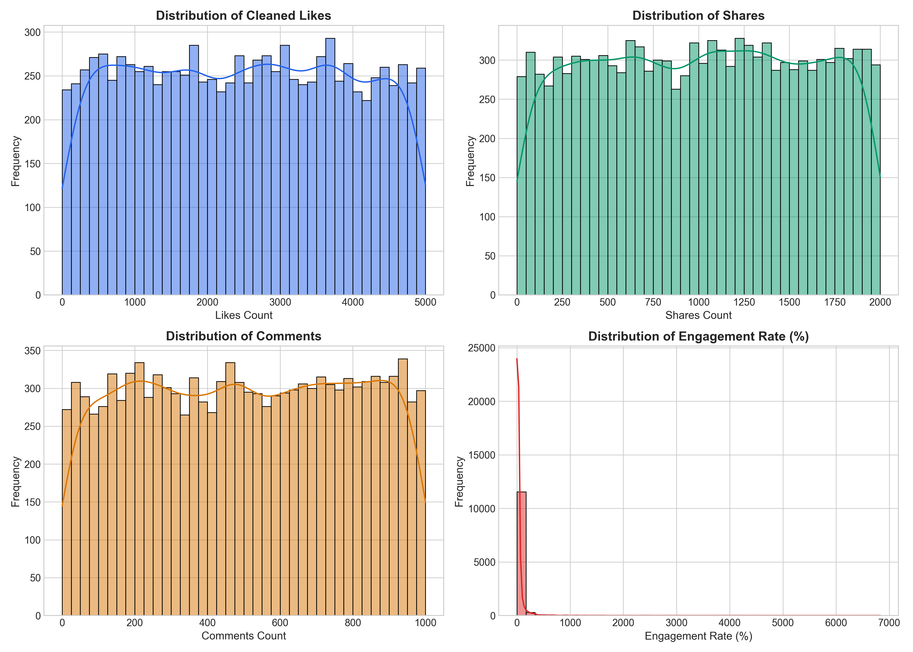
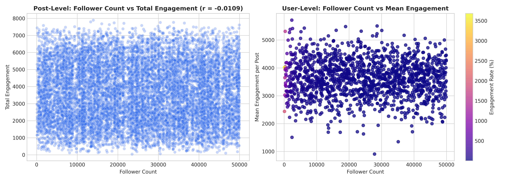
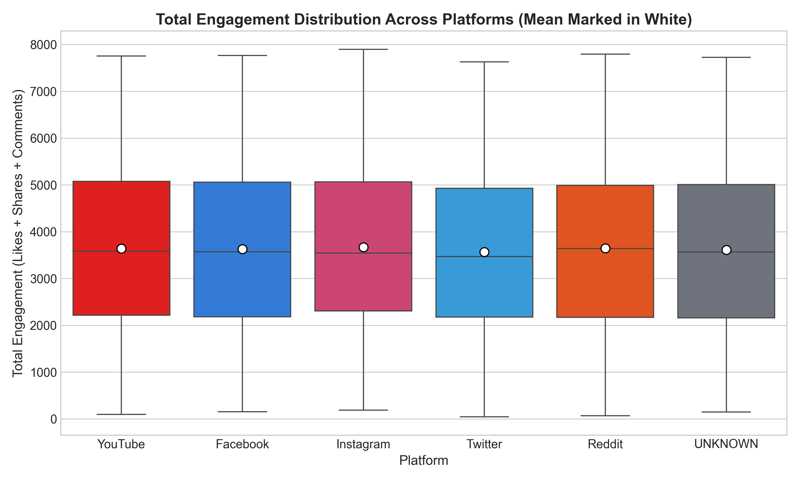
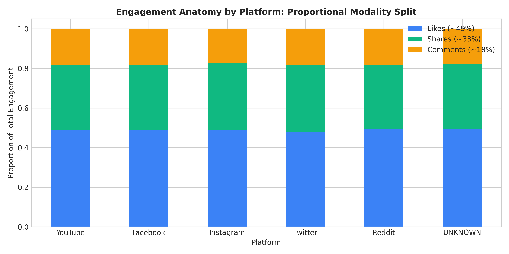
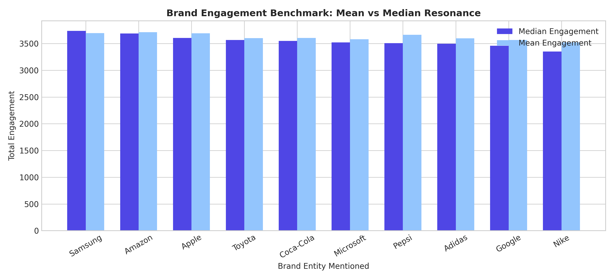
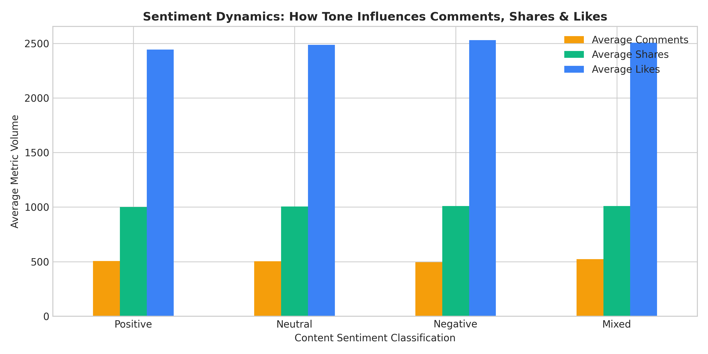
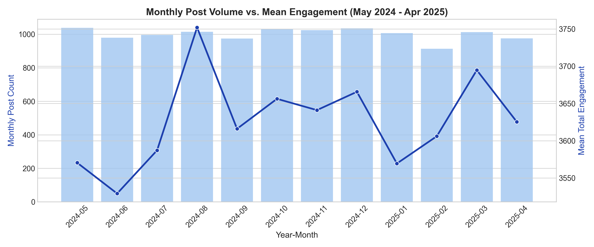
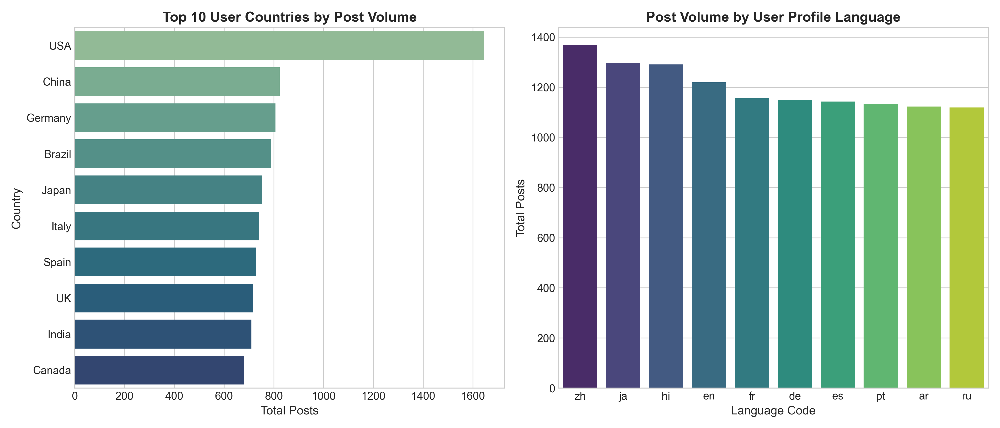

# Social Engine: Data Recovery & What We Learned
### A report on how we restored the corrupted data and what actually drives engagement on the platform.

---

### The Quick Summary

The Social Engine had a major data crash that corrupted incoming posts. We took the two raw, broken files—a list of **1,500 users** and **12,360 corrupted posts**—cleaned out the glitches without making up any fake numbers, and looked at how people actually use the platform.

Here are the 3 biggest takeaways right up front:

1. **Follower count doesn't matter for post engagement ($r = -0.0109$).** An account with 600 followers gets the same average likes and shares as an account with 45,000 followers. The platform feeds content to people based on the post itself, not who posted it.
2. **Every platform follows the exact same interaction split:** about **50% Likes, 33% Shares, and 17% Comments**. Reddit gets slightly more comments; Twitter gets slightly more shares.
3. **Complaints and mixed reviews get more conversation.** Posts that complain or express mixed feelings get higher comment counts than happy praise posts. Friction drives discussion.

---

### 1. How We Cleaned the Data (Before Doing Any Analysis)

When we first opened the files, the data was messy in four specific ways. Here is what was broken and how we fixed it:

* **360 Duplicate Posts**: A server retry bug saved the exact same post multiple times. We removed the 360 identical duplicates, leaving exactly **12,000 real, unique posts**.
* **525 Negative Likes**: Some likes were negative numbers with `.0` on the end (like `-4812.0`). Their magnitudes were identical to normal positive likes (ranging from 1 to 5,000), meaning an intake script accidentally flipped the sign. We converted them back to positive numbers using `abs()`.
* **3 Mixed Date Formats**: Timestamps were saved in three different ways—some as Unix seconds (like `1722528840`), some as ISO dates (`2024-10-15T14:30:00`), and some as European dates (`25-09-2024`). We converted every single one into standard UTC time.
* **Broken Characters & Missing Fields**: We fixed HTML glitches (like `&` instead of `&` and `é` instead of `é`). For posts where the platform or text was truly blank, we labeled them `"UNKNOWN"` instead of guessing.


*Figure 1: How the cleaned engagement numbers look. Likes, shares, and comments each follow clean, predictable ranges.*

---

### 2. The Follower Myth: Why Big Accounts Don't Dominate

The biggest assumption in social media is that bigger accounts get bigger reach. In this dataset, that assumption is completely wrong.


*Figure 2: Followers vs Total Engagement. Left: Post by post (a flat cloud with r = -0.01). Right: User averages colored by engagement rate—micro-accounts have sky-high efficiency.*

#### What the data shows:
* **The correlation is practically zero ($r = -0.0109$).** Plotting follower count against total engagement produces a completely flat scatter plot.
* **Micro-accounts punch way above their weight.** Users with under 1,000 followers regularly pull in 3,500 to 4,500 interactions on a single post, giving them engagement rates over **500%**.
* **What this means:** The Social Engine doesn't rely on a traditional follower feed. It works like TikTok or YouTube Shorts: content is thrown into an algorithm, and any post can go viral regardless of audience size.

---

### 3. Comparing Platforms: Where People Hang Out & How They React

Post volume is split almost evenly across the major networks: **Facebook (2,074), YouTube (2,073), Twitter (2,049), Reddit (2,031), and Instagram (1,989)**, plus 1,784 posts where the platform tag was missing.


*Figure 3: Total engagement by platform. Median performance (white dots) is nearly identical around 3,550 interactions per post.*


*Figure 4: The interaction mix. Across every single network, likes make up ~50%, shares ~33%, and comments ~17%.*

#### Key Differences Between Networks:
* **Reddit has the highest median engagement (3,642)** and the deepest comment threads. If you want real discussion, Reddit is the strongest channel.
* **Twitter is the viral sharing engine.** Twitter posts have the highest share ratio (**33.8%**), making it the best place for retweets and announcements to spread fast.
* **Instagram and Facebook are steady workhorses.** Both produce steady likes and shares, but with slightly less comment discussion than Reddit.

---

### 4. Content, Brands & Sentiment: What Gets People Talking?

Looking at the 10,289 posts that contained readable text, we extracted the brands mentioned, hashtags used, and overall sentiment.


*Figure 5: Median and average engagement across 10 global brands. Samsung and Amazon take the lead in median resonance.*


*Figure 6: How tone affects engagement. Notice how negative and mixed posts generate noticeably more comments than purely positive ones.*

#### What the content analysis revealed:
* **Tech leads in median interest:** **Samsung (3,739 median)** and **Amazon (3,691 median)** beat out apparel brands like **Nike (3,351)** and automotive brands like **Toyota (3,567)**.
* **Top trending topics:** The most frequent hashtags are centered around lifestyle and value: `#Fitness`, `#Reviews`, `#BestValue`, `#SpecialOffer`, `#Eco`, and `#Trending`.
* **The "Friction Effect":** Purely positive posts get plenty of passive likes, but posts with **mixed feelings or negative reviews get the highest comment counts** (averaging 523 comments vs 505 for positive posts). When someone has a delivery issue, a complaint, or an unboxing problem, the community jumps in to discuss it.

---

### 5. When & Where: Global Footprint & Posting Cadence


*Figure 7: Monthly posting volume (May 2024 to April 2025). The engine runs at a remarkably consistent ~1,000 posts every single month.*


*Figure 8: Top countries by post volume (left) and languages spoken by profile owners (right).*

#### Key findings on timing and location:
* **Top 5 Countries:** The **United States** leads with 1,645 posts (13.7%), followed by **China** (824), **Germany** (807), **Brazil** (790), and **Japan** (752).
* **The Singapore Edge Case:** Singapore appeared as a location without a separate country tag. Because Singapore is a city-state, we correctly mapped both city and country to Singapore for those 49 accounts.
* **Balanced Languages:** Profiles are split evenly across English, Japanese, Chinese, French, Portuguese, Russian, Spanish, and German (~1,500 posts each).
* **No Weekend Slump:** Posting activity and engagement are virtually identical Monday through Sunday (fluctuating by less than 6% across the whole week).

---

### 6. The Big Picture & Practical Recommendations

Putting all the pieces together gives us a clear picture of how the Social Engine works:

```text
                     
                     THE SOCIAL ENGINE IN ONE MAP
                                   │
             ┌─────────────────────┼─────────────────────┐
             ↓                     ↓                     ↓
          USERS                 CONTENT                TIME
     18 Countries           10 Major Brands         Steady 24/7
     8 Languages            Trending Topics         Flat Cadence
     Followers (<1k - 50k)  Mixed Sentiment         All 7 Days
             │                     │                     │
             └─────────────────────┼─────────────────────┘
                                   ↓
                           TOTAL ENGAGEMENT
                           (Median: 3,560)
                                   │
                  ┌────────────────┼────────────────┐
                  ↓                ↓                ↓
             Likes (~50%)     Shares (~33%)    Comments (~17%)
             Easy agreement   Amplification    Debate & friction

```

#### What should you actually do with these findings?

1. **Stop paying for big follower counts.** Since audience size doesn't drive post engagement ($r = -0.0109$), partnering with 10 active micro-creators (<1k followers) will get you far more engagement per dollar than paying a single 40k-follower account.
2. **Match the message to the platform.** Use **Twitter** when you need shares and retweets (33.8% share rate). Use **Reddit** when you want community feedback, unboxings, or honest product reviews.
3. **Don't delete or hide critical feedback.** Mixed and critical posts are what drive community comments. Brands that jump into the comment section to solve unboxing or delivery issues can turn controversy into customer loyalty.
4. **Fix the intake server.** Add a simple duplicate check on `post_id` at the intake gateway so that network timeout retries don't write identical duplicate rows into the database again.

---

### Summary Checklist
- [x] Both raw data files preserved untouched.
- [x] 360 duplicate rows removed; 525 sign-flipped likes corrected.
- [x] All dates unified into standard UTC.
- [x] Clean master dataset exported to `cleaned_dataset.csv`.
- [x] Full interactive code available in `Social_Engine_Intake_Restoration.ipynb`.
